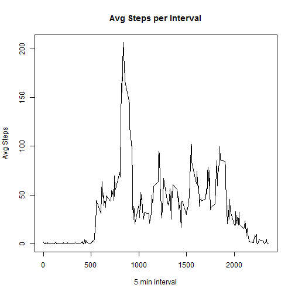
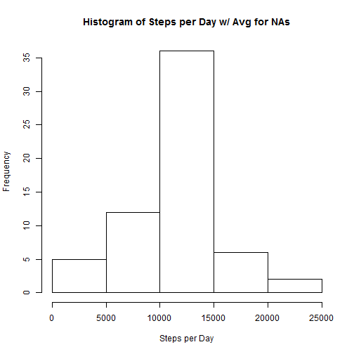
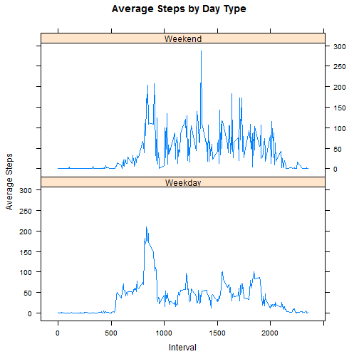

## Loading and preprocessing the data

```r
library(dplyr)
library(xtable)
library(lattice)
library(lubridate)
data <- read.csv("activity.csv")
```


## What is mean total number of steps taken per day?

```r
stepsPerDay <- data %>%
      group_by(date) %>%
      summarize(tot = sum(steps, na.rm = T))

hist(stepsPerDay$tot, main = "Histogram of Steps per Day", xlab = "Steps per Day")
```

 

```r
dtMean <- round(mean(stepsPerDay$tot),digits = 2)
dtMedian <- median(stepsPerDay$tot)
```
#### Mean: 9354.23     
#### Median: 10395


## What is the average daily activity pattern?

```r
stepsPerTime <- data %>%
      group_by(interval) %>%
      summarize(avg = mean(steps, na.rm=T))

plot(stepsPerTime$interval,stepsPerTime$avg,type = "l",main="Avg Steps per Interval",xlab="5 min interval",ylab="Avg Steps")
```

 

```r
dtMax <- filter(stepsPerTime, avg == max(stepsPerTime$avg)) %>% select(interval)
```
#### Interval with highest average steps: 835
   
   
   


## Imputing missing values
I took the interval's average in order to fill in NA values. A better method might be 
to break intervals down by day type

```r
NArows <- data %>%
      filter(is.na(steps))
naRowCount <- count(NArows)
```
#### Rows with NA: 2304


```r
nonNArows <- data %>%
      filter(!is.na(steps))
nonNArows$steps <- as.numeric(nonNArows$steps)

avgData <- select(NArows, -steps) %>% 
      inner_join(stepsPerTime) %>%
      select(avg, date, interval)
```

```
## Joining by: "interval"
```

```r
colnames(avgData) <- colnames(nonNArows)

fullData <- dplyr::union(nonNArows,avgData)

stepsPerDayFull <- fullData %>%
      group_by(date) %>%
      summarize(tot = sum(steps, na.rm = T))

hist(stepsPerDayFull$tot, main = "Histogram of Steps per Day w/ Avg for NAs", xlab = "Steps per Day")
```

 

```r
dtMean <- round(mean(stepsPerDay$tot),digits = 2)
dtMedian <- median(stepsPerDay$tot)
```
#### Mean w/ Interval Avg for NAs: 9354.23     
#### Median w/ Interval Avg for NAs: 10395


## Are there differences in activity patterns between weekdays and weekends?

```r
fullData <- mutate(fullData,dayType = ifelse(wday(as.Date(fullData$date),T) == c("Sun","Sat"),"Weekend","Weekday")) %>%
      group_by(dayType, interval) %>%
      summarize(avg = mean(steps)) %>%
      arrange(interval) 

xyplot(avg ~ interval | dayType, fullData, type="l", layout = c(1,2), xlab = "Interval", ylab="Average Steps",main="Average Steps by Day Type")
```

 
